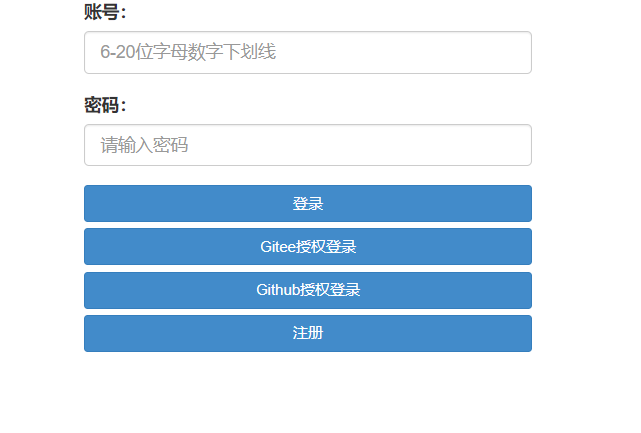
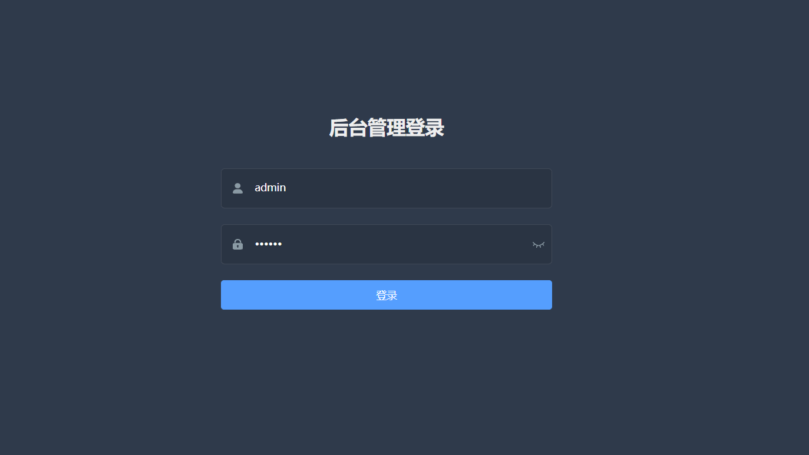
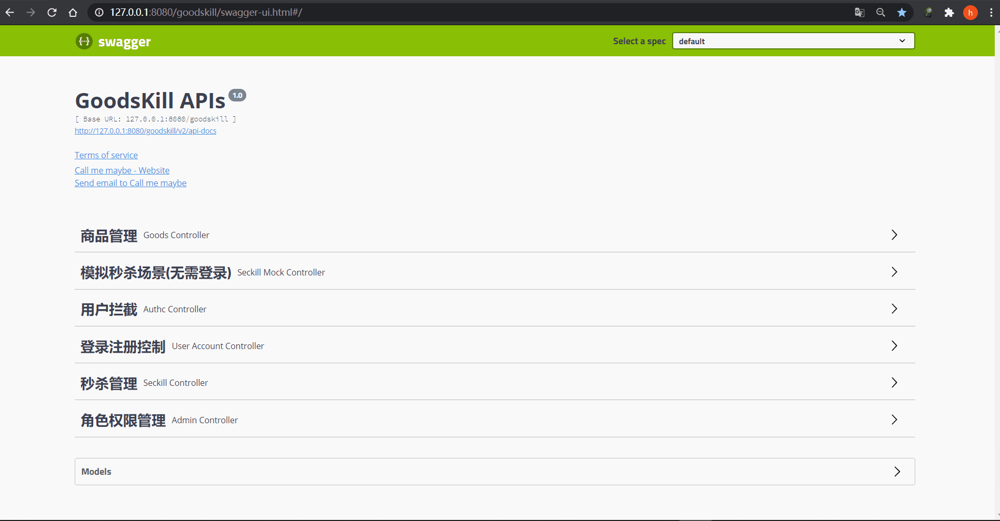

= 前言

image:https://img.shields.io/badge/license-MIT-blue.svg[License,link=LICENSE]
image:https://github.com/techa03/goodsKill/actions/workflows/maven.yml/badge.svg?branch=master[Java CI with Maven,link=https://github.com/techa03/goodsKill/actions/workflows/maven.yml]
image:https://codecov.io/gh/techa03/goodsKill/branch/master/graph/badge.svg[codecov,link=https://codecov.io/gh/techa03/goodsKill]
image:https://sonarcloud.io/api/project_badges/measure?project=techa03_goodsKill&metric=alert_status[Quality Gate Status,link=https://sonarcloud.io/dashboard?id=techa03_goodsKill]
image:https://github.com/techa03/goodsKill/actions/workflows/codeql-analysis.yml/badge.svg?branch=master[CodeQL,link=https://github.com/techa03/goodsKill/actions/workflows/codeql-analysis.yml]

项目命名为 *goodsKill* 一方面有商品秒杀的意思(好像有点chinglish的味道)，另外也可理解为 *good skill*，本项目就是希望搭建一套完整的项目框架，把一些好的技术和开发技巧整合进来（偏向于后端技术），方便学习和查阅。

本项目为慕课网仿购物秒杀项目，功能上整体分为用户注册登录、秒杀商品管理模块。使用Shiro完成登录验证授权以及用户权限验证（权限设计使用RBAC模型），支持OAuth2.0第三方授权登录（目前可通过Gitee，Github进行授权）。 技术上整体采用SpringMVC+RESTFUL风格，Mybatis持久层框架，采用Dubbo3.x{empty}footnote:[由于SpringCloudAlibaba官方暂未支持Dubbo 3.x，本项目采用dubbo-spring-boot-starter集成，使用zookeeper注册中心]以及Feign实现分布式服务调用，服务注册发现以及配置中心使用Nacos。

本项目在原基础上扩展了部分功能，例如支持数据库分库分表、分布式事务，并提供基本的秒杀解决方案（通过模拟接口实现）。

* 集成SpringCloudAlibaba Sentinel限流组件，可以针对Http请求限流

* 集成服务网关，采用Spring Cloud Gateway网关组件，支持动态路由刷新

== 💎分支介绍

``dev_gradle``分支为使用gradle构建工具管理项目依赖（已停更），``dev_maven``分支对应maven构建工具（Spring Framework版本4.x，已停更），``master``分支基于最新Spring Cloud体系构建。本项目功能目前比较简陋且有很多不完善的地方，真实的秒杀场景远比本项目中的实现方式复杂，本项目省略了真实场景中的部分技术实现细节，目前仅作学习参考之用，如果觉得本项目对你有帮助的请多多star支持一下👍~~~~。
____

附：码云项目链接 `https://gitee.com/techa/goodsKill`,clone速度慢的用码云仓库拉吧，不定期同步到码云~

____

== ✨技术选型

=== 📌后端技术:

|===
|技术 |名称 |官网

|Spring Boot |框架 |https://spring.io/projects/spring-boot
|MyBatis-Plus |MyBatis增强工具 |https://mp.baomidou.com/
|Hikari |数据库连接池 |https://github.com/brettwooldridge/HikariCP
|ZooKeeper |分布式协调服务 |http://zookeeper.apache.org/
|Redis |分布式缓存数据库 |https://redis.io/
|Kafka |消息队列 |http://kafka.apache.org/
|RabbitMQ |消息队列 |https://www.rabbitmq.com/
|Logback |日志组件 |https://logback.qos.ch/
|Maven |项目构建管理 |http://maven.apache.org/
|Swagger3 |项目API文档生成及测试工具 |http://swagger.io/
|Mockito |mock类生成测试工具 |https://site.mockito.org/
|Jacoco |测试覆盖率报告插件 |http://www.eclemma.org/jacoco/
|Shiro |用户权限安全管理框架 |https://shiro.apache.org/
|MongoDB |Mongo数据库 |https://www.mongodb.com/
|MySQL |MySQL数据库 |https://www.mysql.com/
|Reactor |反应式异步编程 |https://projectreactor.io/
|Spring Session |Spring会话管理 |https://spring.io/projects/spring-session
|Elasticsearch |全文搜索引擎 |https://www.elastic.co
|H2 |H2数据库 |http://www.h2database.com/html/main.html
|Sharding-JDBC |分库分表组件 |https://shardingsphere.apache.org
|Spring Cloud Alibaba |Cloud Alibaba组件 |https://github.com/alibaba/spring-cloud-alibaba
|Apache Dubbo | RPC服务远程调用框架 |https://github.com/apache/dubbo
|Spring Cloud Gateway |网关组件 |https://spring.io/projects/spring-cloud-gateway
|Kotlin |Kotlin |https://kotlinlang.org/
|Seata |分布式事务解决方案 |http://seata.io/zh-cn/index.html
|Spring Security OAuth2.0 |OAuth2.0授权组件 |https://spring.io/projects/spring-security-oauth
|Canal |基于MySQL数据库的增量日志解析工具 |https://github.com/alibaba/canal
|MinIO |一款高性能、分布式的对象存储系统 |https://min.io/
|===

=== 📌前端技术:
|===
|技术 |名称 |官网

|JQuery |函式库 |http://jquery.com/
|Bootstrap |前端框架 |http://getbootstrap.com/
|LayUI |前端UI框架 |https://github.com/sentsin/layui
|===

== 📝项目模块介绍

----
goodsKill
|--goodskill-admin                          ||SpringBoot Admin监控服务端，支持Spring Cloud微服务发现
|--goodskill-canal                          ||用于完成MySQL数据库binlog收集的canal客户端程序
|--goodskill-chat-provider                  ||一个基于netty实现的简易聊天程序
|--goodskill-gateway                        ||微服务网关，支持动态路由加载
|--goodskill-es-provider                    ||elasticsearch搜索服务提供者，提供商品名称检索功能
|   |--goodskill-es-service
|--goodskill-mongo-provider                 ||mongo存储服务提供者
|   |--goodskill-mongo-service
|--goodskill-spring-boot-provider           ||订单、用户、登录、商品管理服务提供者（待拆分）
|   |--goodskill-api                        ||提供服务API接口
|   |--goodskill-mp-dao                     ||数据库访问
|   |--goodskill-entry                      ||实体类
|   |--goodskill-generator                  ||项目代码生成
|   |--goodskill-service                    ||服务API接口实现
|--goodskill-spring-boot-starter            ||项目配置自动装配
|--goodskill-web                            ||提供页面客户端访问，controller层在这一模块
|--goodskill-job                            ||elastic-job定时任务
|--goodskill-seata                          ||集成nacos+dubbo+shardingjdbc+seata的分布式事务解决方案示例
|--goodskill-oauth2                         ||oauth2.0自定义模块
    |--oauth2-auth-server                   ||oauth2.0登录授权服务端，自定义的授权登录服务
    |--oauth2-resource-server               ||oauth2.0资源服务端，自定义的授权登录服务
|--goodskill-swagger-docs                   ||swagger3.0文档聚合访问服务
----

== 🔥🔥秒杀方案

目前实现了几种秒杀方案，通过``SeckillMockController``提供测试接口

Swagger主页测试地址: `http://www.goodskill.com:8080/goodskill/web/swagger-ui/index.html`

聚合Swagger文档地址: `http://localhost:18060/doc.html#/home`（需要开启SwaggerDocsApplication服务）

Spring Boot Admin应用监控地址: `http://www.goodskill.com:19031`, 登录用户名密码：user/123456

Kafka状态监控页面地址: `http://localhost:9001`

Zipkin链路跟踪页面地址: `http://localhost:9411/zipkin/`

* 场景一：Sychronized同步锁实现
* 场景二：Redisson分布式锁实现
* 场景三：ActiveMQ实现(已废弃)
* 场景四：Kafka消息队列实现
* 场景五：数据库原子性更新
* 场景六：实时等待秒杀处理结果(已废弃)
* 场景七：ZooKeeper分布式锁
* 场景八：使用Redis进行秒杀商品减库存操作，秒杀结束后异步发送MQ，使用MongoDB完成数据落地
* 场景九：Spring Cloud Stream实现
* 场景十：Sentinel限流+数据库原子性更新（需搭配sentinel控制台配置资源名``limit``的流控规则）
* 场景十一：数据库原子性更新 + Canal数据库binlog日志监听秒杀结果

.可在web控台查看秒杀结果，打印信息类似：
[%collapsible]
====
[source,text]
----
2021-04-14 21:58:59.857  INFO [goodskill-web,df43cc8f59291c48,df43cc8f59291c48] 15808 --- [           main] o.s.w.controller.SeckillMockController   : 秒杀场景二(redis分布式锁实现)开始时间：Wed Apr 14 21:58:59 CST 2021,秒杀id：1000
2021-04-14 21:59:00.094  INFO [goodskill-web,144aa7910cca9520,2821cb8d62c5a908] 15808 --- [AClOSzbugzYng-1] o.s.w.s.c.SeckillMockResponseListener    : 秒杀活动结束，秒杀场景二(redis分布式锁实现)时间：Wed Apr 14 21:59:00 CST 2021,秒杀id：1000
2021-04-14 21:59:00.101  INFO [goodskill-web,144aa7910cca9520,2821cb8d62c5a908] 15808 --- [AClOSzbugzYng-1] o.s.w.s.c.SeckillMockResponseListener    : 最终成功交易笔数统计中。。。
2021-04-14 21:59:01.616  INFO [goodskill-web,144aa7910cca9520,2821cb8d62c5a908] 15808 --- [AClOSzbugzYng-1] o.s.w.s.c.SeckillMockResponseListener    : 最终成功交易笔数统计中。。。
2021-04-14 21:59:03.129  INFO [goodskill-web,144aa7910cca9520,2821cb8d62c5a908] 15808 --- [AClOSzbugzYng-1] o.s.w.s.c.SeckillMockResponseListener    : 最终成功交易笔数：10
2021-04-14 21:59:03.130  INFO [goodskill-web,144aa7910cca9520,2821cb8d62c5a908] 15808 --- [AClOSzbugzYng-1] o.s.w.s.c.SeckillMockResponseListener    : 历史任务耗时统计：StopWatch '': running time = 36159894800 ns
---------------------------------------------
ns         %     Task name
---------------------------------------------
4492195700  012%  秒杀场景四(kafka消息队列实现)
3164155900  009%  秒杀场景八(秒杀商品存放redis减库存，异步发送秒杀成功MQ，mongoDb数据落地)
6219218300  017%  秒杀场景十(Sentinel限流+数据库原子性更新)
9189080600  025%  秒杀场景七(zookeeper分布式锁)
3135926500  009%  秒杀场景五(数据库原子性更新update set num = num -1)
3342791800  009%  秒杀场景九(基于springcloud stream rabbitmq)
3343433700  009%  秒杀场景一(sychronized同步锁实现)
3273092300  009%  秒杀场景二(redis分布式锁实现)
----
====

== 🧰开发环境版本说明

* JDK: OpenJDK11
* Sharding-JDBC: 4.1.1
* SpringCloud: 2021.x.x
* SpringBoot: 2.7.x
* SpringCloudAlibaba: 2021.x
* Apache Dubbo: 3.x
* Kotlin: 1.6.x
* 使用的Docker镜像
+
|===
|镜像 |版本 |端口 |用户名密码

|Nacos |2.0.3 |8848 |nacos:nacos
|Redis |latest |6379 |密码:123456
|Kafka |3.1.1 |9092 |无
|KafkaManager |latest |9001:9000 |无
|Mongo |4.6.0 |27017 |无
|MySQL |8.0.29 |3306 |root:Password123
|Zookeeper |3.6.2 |2181 |无
|Elasticsearch |7.17.3 |9200 9300 |无
|Kibana |7.17.3 |5601 |无
|RabbitMQ |latest |5672 15672 |无
|Zipkin |latest |9411 |无
|MinIO |latest |19000:9000 19001:9001| root:password
|===

== 🎯快速开始

* 项目根目录``goodsKill``中执行
+
----
  mvn clean install
  或
  #跳过单元测试
  mvn clean install -DskipTests
----

* 默认端口启动nacos、redis、mysql、rabbitmq、kafka、zookeeper，或者使用docker-compose{empty}footnote:[需要安装docker-desktop https://www.docker.com/products/docker-desktop/]命令：
+
[source,bash]
----
  docker-compose -f goodskill-simple.yml up -d
----

* 进入``goodskill-web/src/main/sql``目录，找到``seckill.sql``文件，在本地mysql数据库中建立``seckill``仓库并执行完成数据初始化操作
+

:warning-caption: ⚠️️

[WARNING]
docker-compose启动MySQL镜像时会自动执行初始化脚本，如已执行过上一步本步骤可跳过

* 配置host
[source,text]
+

----
 127.0.0.1       kafka
 127.0.0.1       nacos
 127.0.0.1       redis
 127.0.0.1       mysql
 127.0.0.1       zookeeper
 127.0.0.1       mongo
 127.0.0.1       elasticsearch
 127.0.0.1       rabbitmq
 127.0.0.1       zipkin
 127.0.0.1       logstash
 ##如果网关服务部署在远程机器，此处改为相应的远程机器ip
 127.0.0.1       www.goodskill.com
----

* main方法运行``MongoReactiveApplication``类(mongo服务)

* main方法运行``GoodsKillServiceApplication``类(订单、用户、登录、商品管理服务提供者)

* main方法运行``SampleWebJspApplication``类(web服务)

* 启动完成后访问登录页面 `http://www.goodskill.com:8080/goodskill/web/login`，默认管理员账号admin123，密码：aa123456

* 启动完成后发送一个秒杀模拟请求：
秒杀活动id 1000，商品数量10，执行20次购买操作，使用sychronized同步锁执行，例如：
+
.使用sychronized同步锁执行
====
[source,bash]
curl -X POST "http://www.goodskill.com:8080/goodskill/web/sychronized" \
-H "accept: */*" -H "Content-Type: application/json" -d \
"{ \"requestCount\": 20, \"seckillCount\": 10, \"seckillId\": 1000}"
====
+
.使用Redisson分布式锁执行
====
[source,bash]
curl -X POST "http://www.goodskill.com:8080/goodskill/web/redisson" \
-H "accept: */*" -H "Content-Type: application/json" -d \
"{ \"requestCount\": 20, \"seckillCount\": 10, \"seckillId\": 1000}"
====
+
.使用Redisson分布式锁执行，支持动态配置后台线程池核心线程数以及最大线程数
====
[source,bash]
curl --location --request POST 'http://www.goodskill.com:8080/goodskill/web/limit' \
--header 'User-Agent: apifox/1.0.0 (https://www.apifox.cn)' \
--header 'Content-Type: application/json' \
--data-raw '{
    "maxPoolSize": 10,
    "seckillId": 1000,
    "corePoolSize": 2,
    "seckillCount": 100,
    "requestCount": 120
}'
====
+
请求默认异步执行，可在控制台查看执行日志，如果最终成功交易笔数等于商品数量10则表示没有出现超卖或者少卖问题

== 🕹️️启动完整项目步骤
在快速开始部分基础上增加以下步骤即可启动一个完整项目

* 进入``goodskill-gateway``模块，通过``GatewayApplication``类main方法启动服务网关

* 找到``EsApplication``类main方法启动远程服务

____
额外功能（可选）
____

* 已集成``Sentinel``限流组件，支持``nacos``配置中心方式推送限流规则，使用时需启动``Sentinel``控制台，并以``18088``端口启动，docker环境暂不支持。

* Seata分布式事务测试方法见 https://github.com/techa03/goodsKill/tree/master/goodskill-seata/README.md[Seata分布式事务测试示例运行说明]

* main方法运行``GoodskillAdminApplication``类(微服务健康状态指标监控)

* main方法运行``SwaggerDocsApplication``类(接口文档)

== ❓常见问题
[qanda]
使用idea启动``SampleWebJspApplication``类(goodskill-web模块)时会出现访问不了页面的问题，eclipse无此问题::

配置启动类的工作目录为goodskill-web，具体可参考 https://github.com/techa03/goodsKill/issues/108[issue#108]

docker es镜像启动失败::

出现此问题一般为linux环境，运行以下命令即可 `sysctl -w vm.max_map_count=262144`
，或者修改/etc/sysctl.conf文件，追加以下配置：
+
[source,text]
----
grep vm.max_map_count /etc/sysctl.conf
vm.max_map_count=262144
----

如何使用本项目自定义的OAuth2.0授权服务器进行登录授权？::

待完善。。

项目集成的各个框架之间目前的兼容性如何，可以参考本项目的配置在生产环境使用吗？::

本项目目前依赖的各个主流框架的版本比较新，尚未经过完整测试，目前仅用于学习。如果要在生产环境使用，建议使用官方推荐的稳定版本。比如目前的Spring Cloud Alibaba Dubbo官方不建议生产上使用，Spring Cloud Alibaba官方推荐的稳定版为2.2.x{empty}footnote:[附 https://start.aliyun.com/bootstrap.html[SpringCloudAlibaba兼容版本说明]]。

服务启动控制台报ERROR日志 ``no available service found in cluster 'default', please make sure registry config correct and keep your seata server running`` 如何解决？::

启动``seata-server``服务即可（docker-compose.yml文件中已提供），可参照Seata官网添加nacos相关配置。如未使用分布式事务，可忽略该错误，不影响服务正常运行

== 📚分库分表情况说明

|===
|表 |数据库 |是否分库 |分库字段 |是否分表 |分表字段

|success_killed |MySQL |是（同一服务器中，分为seckill和seckill_01两个库） |seckill_id |是（分为success_killed_0,success_kill_1两张表） |user_phone
|===

:note-caption: 📢
[NOTE]
其他表均未分库分表，默认使用seckill作为主库

== 🔖服务网关说明
* `http://www.goodskill.com/goodskill/mongo/**` 对应访问``goodskill-mongo-provider``服务
* `http://www.goodskill.com/goodskill/es/**` 对应访问``goodskill-es-provider``服务
* `http://www.goodskill.com/goodskill/seata/**` 对应访问``goodskill-seata``服务
* `http://www.goodskill.com/goodskill/common/**` 对应访问``goodskill-service-provider``服务
____

动态路由配置说明
____
* 网关支持动态加载路由配置，修改后实时生效，使用时需要在nacos配置中心添加配置文件，文件名可通过``application.yml``中的``nacos.router.data.id``配置进行修改（默认nacos dataId为``goodskill-gateway-routes``），例如：

+
.路由配置文件内容为json数组格式
====
[source,json]
[
    {
        "id": "goodskill-service-provider",
        "predicates": [
            {
                "name": "Path",
                "args": {
                    "_genkey_0": "/goodskill/common/**"
                }
            }
        ],
        "filters": [
            {
                "name": "StripPrefix",
                "args": {
                    "_genkey_1": "2"
                }
            }
        ],
        "uri": "lb://goodskill-service-provider"
    }
]
====

== 🔨后续更新计划

|===
|功能 |进度 |完成时间 |说明
|集成Spring Cloud Alibaba组件 |✅ |2020.5 |目前已集成nacos、sentinel、dubbo、seata组件
|完善JWT用户鉴权，并提供通用服务接口 |✅ |2020.12 |
|集成分布式事务解决方案 |✅ |2021.2 |
|增加OAuth2.0授权登录模块 |✅ |2021.9 |增加自定义OAuth2.0授权以及资源服务，并支持第三方授权登录
|集成ELK日志采集 |✅ |2021.12 |
|使用canal收集数据库变更binlog，秒杀结束及时通知 |✅ |2022.5 |
|JDK版本升级到17 |⏳ | |
|尝试使用COLA重构部分模块 |⏳ | |
|前后端分离、页面美化 |⏳ | | 基于vue-element-admin开发
|===

=== API接口

image:./doc/shortcut/%E5%BE%AE%E4%BF%A1%E6%88%AA%E5%9B%BE_20170623222039.png[image]

=== API接口说明

image:./doc/shortcut/%E5%BE%AE%E4%BF%A1%E6%88%AA%E5%9B%BE_20180819224521.png[image]

== 💻页面展示

==== 普通用户登录

==== 普通用户注册

image:./doc/shortcut/QQ%E6%B5%8F%E8%A7%88%E5%99%A8%E6%88%AA%E5%9B%BE20180701215804.png[image]

==== 主页

image:./doc/shortcut/QQ%E6%B5%8F%E8%A7%88%E5%99%A8%E6%88%AA%E5%9B%BE20180701215849.png[image]

==== 商品查询

____

搜索框下拉商品候选信息基于elasticsearch实现，支持关键词高亮显示

____

image:doc/shortcut/%E5%BE%AE%E4%BF%A1%E6%88%AA%E5%9B%BE_20200523214633.png[image]

==== 后台管理系统登录

==== 后台管理系统（开发中）

image:doc/shortcut/img_1.png[image]

==== 商品列表限流

image:doc/shortcut/微信截图_20200802182806.png[image]

==== Kafka状态监控

image:doc/shortcut/微信截图_20210130152701.png[image]

==== 模拟秒杀接口测试

== 📑数据库表结构

image:doc/model_table.png[image]

== 📖参考文档

* 解决Docker容器连接 Kafka 连接失败问题：`https://www.cnblogs.com/hellxz/p/why_cnnect_to_kafka_always_failure.html`
