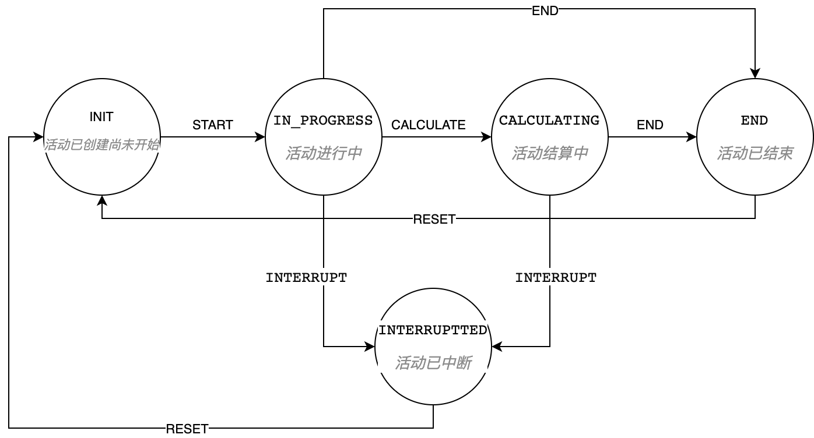

= 前言

image:https://img.shields.io/badge/license-MIT-blue.svg[License,link=LICENSE]
image:https://github.com/techa03/goodsKill/actions/workflows/maven.yml/badge.svg?branch=master[Java CI with Maven,link=https://github.com/techa03/goodsKill/actions/workflows/maven.yml]
image:https://codecov.io/gh/techa03/goodsKill/branch/master/graph/badge.svg[codecov,link=https://codecov.io/gh/techa03/goodsKill]
image:https://github.com/techa03/goodsKill/actions/workflows/codeql.yml/badge.svg?branch=master[CodeQL,link=https://github.com/techa03/goodsKill/actions/workflows/codeql.yml]

项目命名为 *goodsKill* 一方面有商品秒杀的意思(好像有点chinglish的味道)，另外也可理解为 *good skill*，本项目就是希望搭建一套完整的项目框架，把一些好的技术和开发技巧整合进来（偏向于后端技术），方便学习和查阅。

本项目为模拟秒杀项目，提供统一秒杀模拟请求接口，技术上整体采用SpringMVC + Mybatis持久层框架，采用Dubbo3.x{empty}footnote:[由于SpringCloudAlibaba官方暂未支持Dubbo 3.x，本项目采用dubbo-spring-boot-starter集成]，服务注册发现以及配置中心使用Nacos，支持数据库分库分表、分布式事务，使用状态机完成数据状态间的转换（基于Spring Statemachine实现）。

== 💎 分支介绍

``master``分支基于最新Spring Cloud 2023.x + Spring Boot 3.x + JDK21体系构建，目前仅保留核心的模拟秒杀API接口，如需使用Spring Boot 2.7.x + JDK11版本可以切换到tag https://github.com/techa03/goodsKill/tree/v2.7.4[v2.7.4]（支持登录注册以及简单的后台管理功能）。master分支目前升级改造中，功能不够稳定，如遇代码报错建议使用老版本。

本项目功能目前比较简陋且有很多不完善的地方，真实的秒杀场景远比本项目中的实现方式复杂，本项目省略了真实场景中的部分技术实现细节，目前仅作学习参考之用，如果觉得本项目对你有帮助的请多多star支持一下👍~~~~。
____

附：码云项目链接 `https://gitee.com/techa/goodsKill`,clone速度慢的用码云仓库拉吧，不定期同步到码云~

____

== ✨ 技术选型

|===
|使用的工具或框架 |名称 |官网

|Spring Boot |Spring Boot框架 |https://spring.io/projects/spring-boot
|MyBatis-Plus |MyBatis增强工具 |https://mp.baomidou.com/
|ZooKeeper |分布式协调服务 |http://zookeeper.apache.org/
|Redis |分布式缓存数据库 |https://redis.io/
|Kafka |消息队列 |http://kafka.apache.org/
|RabbitMQ |消息队列 |https://www.rabbitmq.com/
|MongoDB |Mongo数据库 |https://www.mongodb.com/
|MySQL |MySQL数据库 |https://www.mysql.com/
|Elasticsearch |全文搜索引擎 |https://www.elastic.co
|Sharding-JDBC |分库分表组件 |https://shardingsphere.apache.org
|Spring Cloud Alibaba |Cloud Alibaba组件 |https://github.com/alibaba/spring-cloud-alibaba
|Apache Dubbo | RPC服务远程调用框架 |https://github.com/apache/dubbo
|Spring Cloud Gateway |网关组件 |https://spring.io/projects/spring-cloud-gateway
|Seata |分布式事务解决方案 |http://seata.io/zh-cn/index.html
|Spring Security OAuth2.0 |OAuth2.0授权组件 |https://spring.io/projects/spring-security-oauth
|GraphQL |一种用于 API 的查询语言 |https://docs.spring.io/spring-graphql/docs/current/reference/html
|Spring Statemachine |Spring 状态机 |https://spring.io/projects/spring-statemachine
|Sa-Token |轻量级权限认证框架 |https://sa-token.cc/
|===

== 📝 项目模块介绍

----
goodsKill
|--goodskill-admin                          ||SpringBoot Admin监控服务端，支持Spring Cloud微服务发现
|--goodskill-gateway                        ||微服务API网关，统一服务鉴权，支持动态路由加载
|--goodskill-order-provider                 ||订单服务提供者
|   |--goodskill-order-service
|--goodskill-seckill-provider               ||秒杀服务提供者
|   |--goodskill-api                        ||提供服务API接口
|   |--goodskill-service                    ||服务API接口实现
|--goodskill-spring-boot-starter            ||项目配置自动装配
|--goodskill-web                            ||提供秒杀模拟接口访问
|--goodskill-job                            ||elastic-job定时任务
|--goodskill-seata                          ||集成nacos+dubbo+shardingjdbc+seata的分布式事务解决方案示例
|--goodskill-auth                           ||auth登录以及授权模块
|   |--auth-service                         ||基于Sa-Token框架的用户登录授权服务
    |--oauth2-auth-server                   ||oauth2.0登录授权服务端，自定义的登录授权服务
    |--oauth2-resource-server               ||oauth2.0资源服务端，自定义的登录授权服务
----

== 🔥🔥 秒杀方案

目前实现了几种秒杀方案，通过``SeckillMockController``提供测试接口

聚合网关Openapi文档地址: `http://localhost/doc.html#/home`（需要开启网关服务）

Spring Boot Admin应用监控地址: `http://www.goodskill.com:19031`, 登录用户名密码：user/123456

* 场景一：Sychronized同步锁实现
* 场景二：Redisson分布式锁实现
* 场景三：ActiveMQ实现(已废弃)
* 场景四：Kafka消息队列实现
* 场景五：数据库原子性更新
* 场景六：实时等待秒杀处理结果(已废弃)
* 场景七：ZooKeeper分布式锁
* 场景八：使用Redis进行秒杀商品减库存操作，秒杀结束后异步发送MQ，使用MongoDB完成数据落地
* 场景九：Spring Cloud Stream实现
* 场景十：Sentinel限流+数据库原子性更新（需搭配sentinel控制台配置资源名``limit``的流控规则）

.可在web控台查看秒杀结果，打印信息类似：
[%collapsible]
====
[source,text]
----
2021-04-14 21:58:59.857  INFO [goodskill-web,df43cc8f59291c48,df43cc8f59291c48] 15808 --- [           main] o.s.w.controller.SeckillMockController   : 秒杀场景二(redis分布式锁实现)开始时间：Wed Apr 14 21:58:59 CST 2021,秒杀id：1000
2021-04-14 21:59:00.094  INFO [goodskill-web,144aa7910cca9520,2821cb8d62c5a908] 15808 --- [AClOSzbugzYng-1] o.s.w.s.c.SeckillMockResponseListener    : 秒杀活动结束，秒杀场景二(redis分布式锁实现)时间：Wed Apr 14 21:59:00 CST 2021,秒杀id：1000
2021-04-14 21:59:00.101  INFO [goodskill-web,144aa7910cca9520,2821cb8d62c5a908] 15808 --- [AClOSzbugzYng-1] o.s.w.s.c.SeckillMockResponseListener    : 最终成功交易笔数统计中。。。
2021-04-14 21:59:01.616  INFO [goodskill-web,144aa7910cca9520,2821cb8d62c5a908] 15808 --- [AClOSzbugzYng-1] o.s.w.s.c.SeckillMockResponseListener    : 最终成功交易笔数统计中。。。
2021-04-14 21:59:03.129  INFO [goodskill-web,144aa7910cca9520,2821cb8d62c5a908] 15808 --- [AClOSzbugzYng-1] o.s.w.s.c.SeckillMockResponseListener    : 最终成功交易笔数：10
2021-04-14 21:59:03.130  INFO [goodskill-web,144aa7910cca9520,2821cb8d62c5a908] 15808 --- [AClOSzbugzYng-1] o.s.w.s.c.SeckillMockResponseListener    : 历史任务耗时统计：StopWatch '': running time = 36159894800 ns
---------------------------------------------
ns         %     Task name
---------------------------------------------
4492195700  012%  秒杀场景四(kafka消息队列实现)
3164155900  009%  秒杀场景八(秒杀商品存放redis减库存，异步发送秒杀成功MQ，mongoDb数据落地)
6219218300  017%  秒杀场景十(Sentinel限流+数据库原子性更新)
9189080600  025%  秒杀场景七(zookeeper分布式锁)
3135926500  009%  秒杀场景五(数据库原子性更新update set num = num -1)
3342791800  009%  秒杀场景九(基于springcloud stream rabbitmq)
3343433700  009%  秒杀场景一(sychronized同步锁实现)
3273092300  009%  秒杀场景二(redis分布式锁实现)
----
====

== 🧰 开发环境版本说明

* JDK: OpenJDK21
* Sharding-JDBC: 5.5.0
* SpringCloud: 2023.x.x
* SpringBoot: 3.2.x
* SpringCloudAlibaba: 2023.x.x
* Apache Dubbo: 3.x
* 使用的Docker镜像
+
|===
|镜像 |版本 |端口 |用户名密码

|Nacos |2.3.2-slim |8848 |nacos:nacos
|Redis |latest |6379 |密码:123456
|Kafka |3.1.1 |9092 |无
|KafkaManager |latest |9001:9000 |无
|Mongo |6.0.7 |27017 |无
|MySQL |8.0.29 |3306 |root:Password123
|Zookeeper |3.6.2 |2181 |无
|Elasticsearch |7.17.3 |9200 9300 |无
|Kibana |7.17.3 |5601 |无
|RabbitMQ |latest |5672 15672 |无
|===

== 🎯 快速开始
* 项目根目录``goodsKill``中执行
+
----
  mvn clean install
  或
  #跳过单元测试
  mvn clean install -DskipTests
----

* 默认端口启动nacos、redis、mysql、rabbitmq、kafka、zookeeper、elasticsearch，或者使用docker-compose{empty}footnote:[需要安装docker-desktop https://www.docker.com/products/docker-desktop/]命令：
+
[source,bash]
----
  docker-compose -f goodskill-simple.yml up -d
----

* 进入``goodskill-web/src/main/sql``目录，找到``seckill.sql``文件，在本地mysql数据库中建立``seckill``仓库并执行完成数据初始化操作
+

:warning-caption: ⚠️️

[WARNING]
docker-compose启动MySQL镜像时会自动执行初始化脚本，如已执行过上一步本步骤可跳过

* 配置host
[source,text]
+
----
 127.0.0.1       kafka
 127.0.0.1       nacos
 127.0.0.1       redis
 127.0.0.1       mysql
 127.0.0.1       zookeeper
 127.0.0.1       mongo
 127.0.0.1       elasticsearch
 127.0.0.1       rabbitmq
 127.0.0.1       logstash
 ##如果网关服务部署在远程机器，此处改为相应的远程机器ip
 127.0.0.1       www.goodskill.com
----

* main方法运行``OrderApplication``类(订单服务)

* main方法运行``SeckillApplication``类(秒杀管理服务提供者)

* main方法运行``SampleWebApplication``类(模拟秒杀web服务)

* 发送一个秒杀模拟请求：
秒杀活动id 1000，商品数量10，执行20次购买操作，使用sychronized同步锁执行，例如：
+
可直接使用以下命令发送模拟秒杀请求，每个秒杀活动seckillId对应唯一的一个商品id，每次执行接口时会有一个库存初始化动作，接口执行完成后可重复调用

+
.使用sychronized同步锁执行
====
[source,bash]
curl -X POST "http://www.goodskill.com:8080/sychronized" \
-H "accept: */*" -H "Content-Type: application/json" -d \
"{ \"requestCount\": 20, \"seckillCount\": 10, \"seckillId\": 1000}"
====
+
.使用Redisson分布式锁执行
====
[source,bash]
curl -X POST "http://www.goodskill.com:8080/redisson" \
-H "accept: */*" -H "Content-Type: application/json" -d \
"{ \"requestCount\": 20, \"seckillCount\": 10, \"seckillId\": 1000}"
====
+
.使用Redisson分布式锁执行，支持动态配置后台线程池核心线程数以及最大线程数
====
[source,bash]
curl --location --request POST 'http://www.goodskill.com:8080/limit' \
--header 'User-Agent: apifox/1.0.0 (https://www.apifox.cn)' \
--header 'Content-Type: application/json' \
--data-raw '{
    "maxPoolSize": 10,
    "seckillId": 1000,
    "corePoolSize": 2,
    "seckillCount": 100,
    "requestCount": 120
}'
====
+
请求默认异步执行，可在控制台查看执行日志，如果最终成功交易笔数等于商品数量10则表示没有出现超卖或者少卖问题

== 🕹️️ 启动其他可选项目步骤
在快速开始部分基础上增加以下步骤即可启动一个完整项目

* 进入``goodskill-gateway``模块，通过``GatewayApplication``类main方法启动服务网关，统一通过网关访问各个服务

+
- `http://www.goodskill.com/api/order/**` 对应访问``goodskill-order-provider``服务
- `http://www.goodskill.com/api/seata/**` 对应访问``goodskill-seata``服务
- `http://www.goodskill.com/api/seckill/**` 对应访问``goodskill-seckill``服务
- `http://www.goodskill.com/api/auth/**` 对应访问``goodskill-auth``服务
- `http://www.goodskill.com/api/web/**` 对应访问``goodskill-web``服务

* 已集成``Sentinel``限流组件，支持``nacos``配置中心方式推送限流规则，使用时需启动``Sentinel``控制台，并以``18088``端口启动，docker环境暂不支持。

* Seata分布式事务测试方法见 https://github.com/techa03/goodsKill/tree/master/goodskill-seata/README.md[Seata分布式事务测试示例运行说明]

* main方法运行``GoodskillAdminApplication``类(微服务健康状态指标监控)

== ❓常见问题
[qanda]
docker es镜像启动失败::

出现此问题一般为linux环境，运行以下命令即可 `sysctl -w vm.max_map_count=262144`
，或者修改/etc/sysctl.conf文件，追加以下配置：
+
[source,text]
----
grep vm.max_map_count /etc/sysctl.conf
vm.max_map_count=262144
----

如何使用本项目自定义的OAuth2.0授权服务器进行登录授权？::

待完善。。

项目集成的各个框架之间目前的兼容性如何？::

本项目目前依赖的各个主流框架的版本比较新，尚未经过完整测试{empty}footnote:[附 https://start.aliyun.com/bootstrap.html[SpringCloudAlibaba]兼容版本说明]。

服务启动控制台报ERROR日志 ``no available service found in cluster 'default', please make sure registry config correct and keep your seata server running`` 如何解决？::

启动``seata-server``服务即可（docker-compose.yml文件中已提供），可参照Seata官网添加nacos相关配置。如未使用分布式事务，可忽略该错误，不影响服务正常运行

docker-compose无法拉取镜像::

hub.docker被墙，国内可使用阿里云镜像加速器，具体操作见 https://cr.console.aliyun.com/cn-hangzhou/instances/mirrors[阿里云镜像加速器]

使用JDK17以上启动项目失败::

启动时添加以下jvm参数，例如：
+
[source,text]
----
--add-opens java.base/java.lang=ALL-UNNAMED
--add-opens java.base/java.util=ALL-UNNAMED
--add-opens java.base/java.util.concurrent=ALL-UNNAMED
--add-opens java.base/java.math=ALL-UNNAMED
--add-opens java.base/sun.reflect.generics.reflectiveObjects=ALL-UNNAMED
----

== 🖲️ 状态机说明
目前秒杀活动状态的控制基于Spring Statemachine状态机实现，使用状态机的优点：

* 统一控制活动状态，便于状态的集中维护；
* 防止业务状态被随意更改，保证状态的可控更新；

==== 状态机流程图

== 📚分库分表情况说明

|===
|表 |数据库 |是否分库 |分库字段 |是否分表 |分表字段

|success_killed |MySQL |是（同一服务器中，分为seckill和seckill_01两个库） |seckill_id |是（分为success_killed_0,success_kill_1两张表） |user_phone
|===

:note-caption: 📢
[NOTE]
其他表均未分库分表，默认使用seckill作为主库

=== API接口说明

image:./doc/shortcut/%E5%BE%AE%E4%BF%A1%E6%88%AA%E5%9B%BE_20180819224521.png[image]

== 💻相关页面展示

==== 模拟秒杀接口测试

image:doc/shortcut/模拟秒杀接口测试.gif[image]

== 📑数据库表结构

image:doc/model_table.png[image]

== 📖参考文档

* 解决Docker容器连接 Kafka 连接失败问题：`https://www.cnblogs.com/hellxz/p/why_cnnect_to_kafka_always_failure.html`
