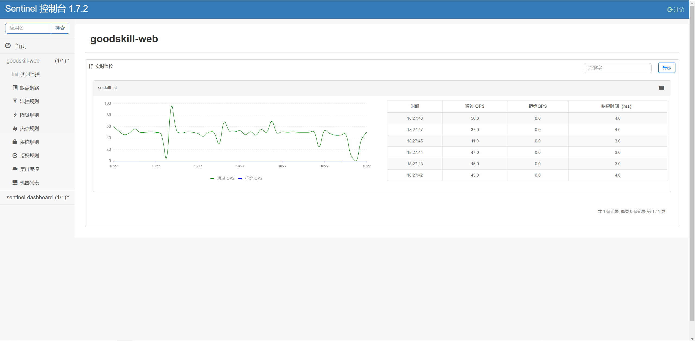

[](https://app.codacy.com/app/275688448/goodsKill?utm_source=github.com&utm_medium=referral&utm_content=techa03/goodsKill&utm_campaign=Badge_Grade_Dashboard)
[](LICENSE)
[](https://travis-ci.org/techa03/goodsKill)
[](https://codecov.io/gh/techa03/goodsKill)
[](https://sonarcloud.io/dashboard?id=techa03_goodsKill)


# 前言
项目命名为goodsKill一方面有商品秒杀项目的意思(好像有点chinglish的味道)，另外也可理解为good skill，本项目就是希望搭建一套完整的项目框架，把一些好的技术和技巧整合进来（偏向于后端技术），方便学习和查阅。

本项目为慕课网仿购物秒杀网站,系统分为用户注册登录、秒杀商品管理模块。注册登录功能目前使用shiro完成权限验证，前端页面基于bootstrap框架搭建，并使用bootstrap-validator插件进行表单验证。 此项目整体采用springMVC+RESTFUL风格，mybatis持久层框架，采用springcloud dubbo实现服务分布式服务调用，服务注册发现使用nacos server。

本项目扩展了秒杀功能，集成了jmock完成service层的测试，支持数据库分库分表，并提供基本的秒杀解决方案（通过模拟接口实现）。

- 集成了内嵌式H2数据库，方便独立进行单元功能测试

- 集成了sentinel限流组件，可以针对http请求以及dubbo rpc调用限流

- 集成了新版支付宝easySDK，通过当面扫完成扫码付款

## 分支介绍
`dev_gradle`分支为使用gradle构建工具管理项目依赖（已停更），`dev_maven`分支对应maven构建工具（springframework版本4.x，已停更），`master`分支基于最新springcloud体系构建。本项目功能目前比较简陋且有很多不完善的地方，仅作学习参考之用，如果觉得本项目对你有帮助的请多多star支持一下👍~~~~。

> 附：码云项目链接[https://gitee.com/techa/goodsKill](https://gitee.com/techa/goodsKill) ,clone速度慢的用码云仓库拉吧，不定期同步到码云~
## 技术选型✨

### 后端技术:
技术 | 名称 | 官网
----|------|----
SpringBoot |  框架 | [https://spring.io/projects/spring-boot](https://spring.io/projects/spring-boot)
MyBatis-Plus | MyBatis增强工具  | [https://mp.baomidou.com/](https://mp.baomidou.com/)
PageHelper | MyBatis物理分页插件  | [http://git.oschina.net/free/Mybatis_PageHelper](http://git.oschina.net/free/Mybatis_PageHelper)
Hikari | 数据库连接池 | [https://github.com/brettwooldridge/HikariCP](https://github.com/brettwooldridge/HikariCP)
ZooKeeper | 分布式协调服务  | [http://zookeeper.apache.org/](http://zookeeper.apache.org/)
Redis | 分布式缓存数据库  | [https://redis.io/](https://redis.io/)
Kafka | 消息队列  | [http://kafka.apache.org/](http://kafka.apache.org/)
RabbitMQ | 消息队列  | [https://www.rabbitmq.com/](https://www.rabbitmq.com/)
Logback | 日志组件  | [https://logback.qos.ch/](https://logback.qos.ch/)
Protobuf & json | 数据序列化  | [https://github.com/google/protobuf](https://github.com/google/protobuf)
Maven | 项目构建管理  | [http://maven.apache.org/](http://maven.apache.org/)
SonarQube | 项目代码质量监控 | [https://www.sonarqube.org/](https://www.sonarqube.org/)
Swagger2 | 项目API文档生成及测试工具 | [http://swagger.io/](http://swagger.io/)
Mockito | mock类生成测试工具 | [https://site.mockito.org/](https://site.mockito.org/)
Jacoco | 测试覆盖率报告插件 | [http://www.eclemma.org/jacoco/](http://www.eclemma.org/jacoco/)
Shiro | 用户权限安全管理框架 | [https://shiro.apache.org/](https://shiro.apache.org/)
MongoDB | Mongo数据库 | [https://www.mongodb.com/](https://www.mongodb.com/)
MySQL | MySQL数据库 | [https://www.mysql.com/](https://www.mysql.com/)
Reactor | 反应式异步编程 | [https://projectreactor.io/](https://projectreactor.io/)
Spring Session | Spring会话管理 | [https://spring.io/projects/spring-session](https://spring.io/projects/spring-session)
Elasticsearch | 全文搜索引擎 | [https://www.elastic.co](https://www.elastic.co)
H2 | H2数据库 | [http://www.h2database.com/html/main.html](http://www.h2database.com/html/main.html)
Sharding-JDBC | 分库分表组件 | [https://shardingsphere.apache.org](https://shardingsphere.apache.org)
Spring Cloud Dubbo | SpringCloud组件 | [https://spring.io/projects/spring-cloud-alibaba](https://spring.io/projects/spring-cloud-alibaba)
Spring Cloud Sentinel | SpringCloud限流降级组件 | [https://spring.io/projects/spring-cloud-alibaba](https://spring.io/projects/spring-cloud-alibaba)
Spring Cloud Nacos | SpringCloud组件 | [https://spring.io/projects/spring-cloud-alibaba](https://spring.io/projects/spring-cloud-alibaba)
Kotlin | Kotlin | [https://kotlinlang.org/](https://kotlinlang.org/)

### 前端技术:
技术 | 名称 | 官网
----|------|----
JQuery | 函式库  | [http://jquery.com/](http://jquery.com/)
Bootstrap | 前端框架  | [http://getbootstrap.com/](http://getbootstrap.com/)
LayUI | 前端UI框架 | [http://www.layui.com/](http://www.layui.com/)

## 项目模块介绍
```
goodsKill
|--goodskill-chat-provider                  ||聊天室服务提供者（待完成）
|--goodsKill-common                         ||项目公共服务（待补充）
|--goodskill-gateway                        ||微服务网关
|--goodsKill-es-provider                    ||elasticsearch搜索服务提供者，目前提供根据商品名称检索商品库
|   |--goodskill-es-api                     
|   |--goodskill-es-dao                     
|   |--goodskill-es-service                 
|--goodsKill-mongo-provider                 ||mongo存储服务提供者
|   |--goodskill-mongo-service              
|--goodsKill-spring-boot-provider           ||订单、用户、登录、商品管理服务提供者（待拆分）
|   |--goodsKill-api
|   |--goodsKill-mp-dao                     ||使用MyBatis-Plus访问MySql数据源  
|   |--goodsKill-entry                      
|   |--goodsKill-generator                  
|   |--goodsKill-service                    
|   |--goodsKill-util                       
|--goodskill-spring-boot-starter            ||项目配置自动装配
|--goodsKill-spring-boot-web-consumer       ||提供页面客户端访问，controller层在这一模块
|   |--goodsKill-web   
|--goodskill-job                            ||elastic-job定时任务 
```

## 开发环境版本说明
- JDK: OpenJDK11
- MySQL: 8.0+
- Kafka: 2.5.0
- MongoDB: 4.0+
- Elasticsearch: 7.7.0
- Sharding-JDBC: 4.1.1
- RabbitMQ: 3.8.5
- SpringCloud: Hoxton.SR9
- SpringBoot: 2.3.x.RELEASE
- SpringCloudAlibaba: 2.2.1.RELEASE

> **注**:其他环境版本暂未测试

## 如何启动项目
> #### 方法一：使用Docker镜像构建脚本

- 项目根目录goodsKill中执行
  ```
  mvn clean install
  或 
  #跳过单元测试
  mvn clean install -DskipTests
  ```
- 进入项目根目录(确保已安装compose以支持docker-compose命令)，执行以下命令：
     ```
    docker-compose up （第一次运行只需执行此命令）
    or
    docker-compose up -d //-d后台运行
    or
    docker-compose up -d --build //build重新构建镜像文件，针对项目自定义镜像配置需要修改的情况
    or
    docker-compose up -d --no-recreate //如上次以构建容器，则此次会跳过构建容器
     ```
    **注**:推荐使用docker-compose命令（推荐电脑运行内存16G以上），无需手动下载软件安装包，开箱即用。此命令会自动拉取docker镜像并以默认端口运行

    镜像 | 版本 | 端口 | 用户名密码
    ---|---|---|---
    Nacos | latest | 8848 | 无
    Redis | latest | 6379 | 无
    Kafka | latest | 9092 | 无
    Mongo | 4.2.6 | 27017 | 无
    MySQL | 8.0 | 3306 | root:Password123
    Zookeeper | latest | 2181 | 无
    Elasticsearch | 7.7.0 | 9200 9300 | 无
    Kibana | 7.7.0 | 5601 | 无
    RabbitMQ | latest | 5672 15672 | 无


 **注**:除以上镜像外，docker-compose文件还包含项目构建命令，目前暂未列出

> #### 方法二：使用IDEA运行项目

- 如无docker运行环境，可参照官网安装上述应用，本地默认端口启动

- 找到EsApplication类main方法启动远程服务

- 找到GoodsKillRpcServiceApplication类main方法启动远程服务，并且需要在host中加入以下信息
     ```
     127.0.0.1 kafka
     127.0.0.1 nacos
     ```

- 进入goodsKill-web模块根目录，运行命令或直接通过SampleWebJspApplication类main方法启动
     ```
    mvn spring-boot:run -Dspring.profiles.active=dev
     ```

- 如已安装MongoDB，可以main方法启动MongoReactiveApplication，通过使用该服务操作mongo库
  
> #### 导入项目数据库基础数据 ⚠️

- 找到seckill.sql文件，在本地mysql数据库中建立seckill仓库并执行完成数据初始化操作

  **注**:docker-compose启动方式会自动执行初始化脚本，因此无需执行该步骤

- application.yml已包含所有环境配置信息，根据个人需要切换环境配置修改，修改active属性值即可
     ```
     spring:
       profiles:
         active: dev
     ```
- 启动完成后访问登录页面[http://localhost:8080/goodskill/login](http://localhost:8080/goodskill/login)，默认管理员账号admin123，密码：aa123456

> #### 额外功能（可选）
- 已集成sentinel限流组件，支持nacos配置中心方式推送限流规则，使用时需启动sentinel控制台，并以18088端口启动，docker环境暂不支持。

## 打包部署方法
- 可参考Dockerfile文件，如:
```
FROM openjdk:11.0.7-jre
COPY goodsKill-service/target/goodsKill-service.jar /app/goodsKill-service.jar
WORKDIR /app
CMD ["java", "-jar","-Dspring.profiles.active=docker","-Duser.timezone=GMT+08", "goodsKill-service.jar"]
```

## 常见问题
- 使用idea启动SampleWebJspApplication类(goodsKill-web模块)时会出现访问不了页面的问题，eclipse无此问题。
解决办法：配置启动类的工作目录为goodsKill-web
- 新版支付宝SDK已集成，使用时需将AlipayRunner中的alipay对应配置替换成你的支付宝应用配置（本项目基于沙箱环境）
```
    //为了防止启动项目报错默认配置为1，可参考官方文档修改对应配置
    @Value("${alipay.merchantPrivateKey:1}")
    private String merchantPrivateKey;

    @Value("${alipay.alipayPublicKey:1}")
    private String alipayPublicKey;

    @Value("${alipay.notifyUrl:1}")
    private String notifyUrl;

    @Value("${alipay.encryptKey:1}")
    private String encryptKey;

    @Value("${alipay.appId:1}")
    private String appId;

    @Value("${alipay.gatewayHost:openapi.alipaydev.com}")
    private String gatewayHost;

    @Value("${alipay.signType:RSA2}")
    private String signType;

    @Value("${alipay.qrcodeImagePath:1}")
    private String qrcodeImagePath;
```

## 分库分表情况说明
表 | 数据库 | 是否分库 | 分库字段 | 是否分表 | 分表字段
---|---|---|---|---|---
success_killed | MySQL | 是（同一服务器中，分为seckill和seckill_01两个库） | seckill_id | 是（分为success_killed_0,success_kill_1两张表） | user_phone

**注**:其他表均未分库分表，默认使用seckill作为主库

## 秒杀方案🔥🔥
目前实现了几种秒杀方案，通过SeckillMockController提供测试接口

swagger主页测试地址：http://localhost:8080/goodskill/swagger-ui.html#/

swagger增强主页测试地址：http://localhost:8080/goodskill/doc.html

- 场景一：sychronized同步锁实现
- 场景二：redisson分布式锁实现
- 场景三：ActiveMQ实现(已废弃)
- 场景四：Kafka实现
- 场景五：本地事务实现
- 场景六：实时等待秒杀处理结果(已废弃)
- 场景七：zookeeper分布式锁
- 场景八：使用redis进行秒杀商品减库存操作，秒杀结束后异步发送MQ，使用mongoDB完成数据落地
- 场景九：SpringCloudStream Rabbitmq实现

可在web控台查看秒杀结果，打印信息类似：
 ```
2019-03-25 13:40:42.123  INFO 1016 --- [io-18080-exec-9] o.s.w.controller.SeckillMockController   : 秒杀活动开始，秒杀场景三(activemq消息队列实现)时间：Mon Mar 25 13:40:42 CST 2019,秒杀id：1001
2019-03-25 13:40:49.050  INFO 1016 --- [ jmsContainer-1] o.s.web.mqlistener.SeckillTopicListener  : 最终成功交易笔数：100
2019-03-25 13:40:49.050  INFO 1016 --- [ jmsContainer-1] o.s.web.mqlistener.SeckillTopicListener  : 秒杀活动结束，秒杀场景三(activemq消息队列实现)时间：Mon Mar 25 13:40:49 CST 2019,秒杀id：1001
 ```
 
## 后续更新计划🔨
✅ 集成spring cloud alibaba组件

✅ 基于配置中心改造项目配置（支付宝配置保存于nacos配置中心，防止配置泄露）

✅ 新版支付宝SDK集成，使用当面扫完成付款

⏳ 添加秒杀用户聊天室功能，使用netty网络通信，maven分支已经实现，master分支待集成

⏳ 丰富项目文档

### API接口


### API接口说明


## 页面展示

#### 登录：


#### 注册：


#### 主页：


#### 商品查询:
> 搜索框下拉商品候选信息基于elasticsearch实现，支持关键词高亮显示


#### 商品列表限流：


#### 用户角色权限管理：


## 数据库表结构


## 参考文档
- 解决Docker容器连接 Kafka 连接失败问题：https://www.cnblogs.com/hellxz/p/why_cnnect_to_kafka_always_failure.html
