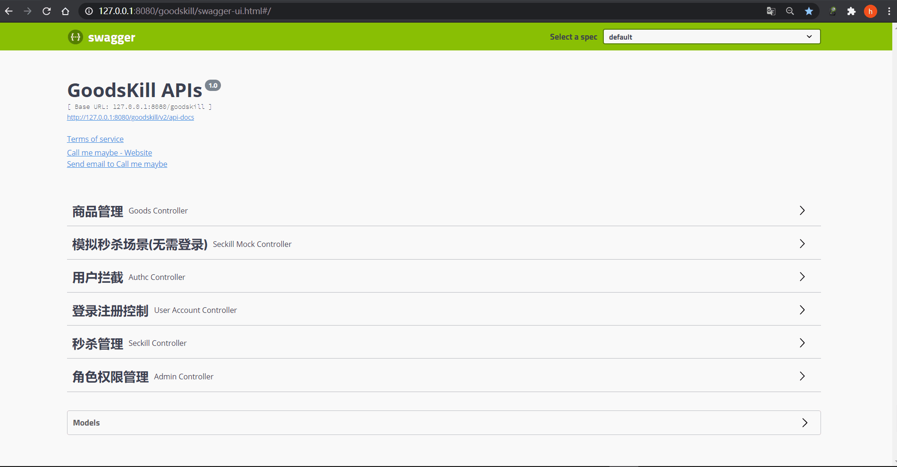
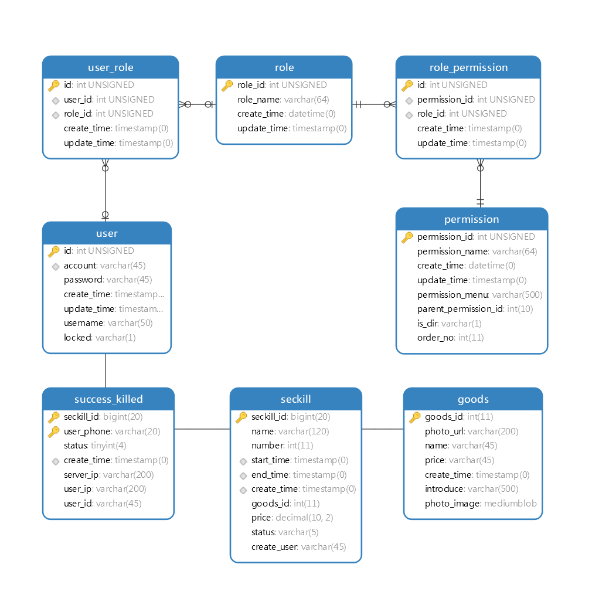

= Introduction

image:https://img.shields.io/badge/license-MIT-blue.svg[License,link=LICENSE]
image:https://github.com/techa03/goodsKill/actions/workflows/maven.yml/badge.svg?branch=main[Java CI with Maven,link=https://github.com/techa03/goodsKill/actions/workflows/maven.yml]
image:https://codecov.io/gh/techa03/goodsKill/branch/main/graph/badge.svg[codecov,link=https://codecov.io/gh/techa03/goodsKill]
image:https://github.com/techa03/goodsKill/actions/workflows/codeql.yml/badge.svg?branch=main[CodeQL,link=https://github.com/techa03/goodsKill/actions/workflows/codeql.yml]

https://github.com/techa03/goodsKill/blob/main/README.adoc[中文说明]

The project is named *goodsKill*, which carries a double meaning - "product flash sale" (with a slight Chinglish flavor) and "*good skill*". This project aims to build a complete framework that integrates excellent technologies and development techniques (focusing on backend technologies) for learning and reference purposes.

This is a flash sale simulation project that provides unified flash sale request interfaces. The technical stack includes SpringMVC + MyBatis persistence framework, with Dubbo 3.x{empty}footnote:[Since SpringCloudAlibaba doesn't officially support Dubbo 3.x yet, this project uses dubbo-spring-boot-starter for integration] + Feign for service-to-service interface calls. Service registration/discovery and configuration center use Nacos. It supports database sharding and distributed transactions, and implements data state transitions using a state machine (based on Spring Statemachine).

The project integrates Spring AI service, allowing flash sale simulations to be performed through an AI bot.

== 💎 Branch Introduction

The ``main`` branch is built on the latest Spring Cloud 2023.x + Spring Boot 3.x + JDK21 system. Currently it only retains core flash sale simulation API interfaces. If you need Spring Boot 2.7.x + JDK11 version, please switch to tag https://github.com/techa03/goodsKill/tree/v2.7.4[v2.7.4] (which supports login/registration and simple admin functions). The main branch is currently undergoing upgrades and may not be stable. If you encounter errors, please use the older version.

This project currently has relatively simple functionality and many incomplete aspects. Real flash sale scenarios are much more complex than the implementation in this project, which omits some technical details of real-world scenarios. Currently it's only for learning and reference purposes. If you find this project helpful, please give it a star 👍~~~~.
____

Note: Gitee project link `https://gitee.com/techa/goodsKill`. If GitHub clone is slow, please use the Gitee repository (synced periodically).

____

== ✨ Technology Stack

|===
|Tool/Framework |Name |Official Site

|Spring Boot |Spring Boot Framework |https://spring.io/projects/spring-boot
|MyBatis-Plus |MyBatis Enhancement Tool |https://mp.baomidou.com/
|ZooKeeper |Distributed Coordination Service |http://zookeeper.apache.org/
|Redis |Distributed Cache Database |https://redis.io/
|Kafka |Message Queue |http://kafka.apache.org/
|RabbitMQ |Message Queue |https://www.rabbitmq.com/
|MongoDB |Mongo Database |https://www.mongodb.com/
|MySQL |MySQL Database |https://www.mysql.com/
|Elasticsearch |Full-text Search Engine |https://www.elastic.co
|Sharding-JDBC |Database Sharding Component |https://shardingsphere.apache.org
|Spring Cloud Alibaba |Cloud Alibaba Components |https://github.com/alibaba/spring-cloud-alibaba
|Apache Dubbo |RPC Framework |https://github.com/apache/dubbo
|Spring Cloud Gateway |Gateway Component |https://spring.io/projects/spring-cloud-gateway
|Seata |Distributed Transaction Solution |http://seata.io/zh-cn/index.html
|Spring Security OAuth2.0 |OAuth2.0 Authorization |https://spring.io/projects/spring-security-oauth
|GraphQL |API Query Language |https://docs.spring.io/spring-graphql/docs/current/reference/html
|Spring Statemachine |Spring State Machine |https://spring.io/projects/spring-statemachine
|Sa-Token |Lightweight Auth Framework |https://sa-token.cc/
|Flyway |Database Version Control |https://flywaydb.org/
|MinIO |Object Storage Service |https://min.io/
|Spring AI |AI Component |https://spring.io/projects/spring-ai
|===

== 📝 Project Modules

----
goodsKill
|--goodskill-admin                          ||SpringBoot Admin monitoring server, supports Spring Cloud service discovery
|--goodskill-ai                             ||AI chatbot service
|--goodskill-gateway                        ||Microservice API gateway, unified authentication, supports dynamic routing
|--goodskill-order-provider                 ||Order service provider
|--goodskill-seckill-provider               ||Flash sale service provider
|--goodskill-spring-boot-starter            ||Project configuration auto-assembly
|--goodskill-common                         ||Common services (currently includes MinIO upload/download)
|--goodskill-web                            ||Provides flash sale simulation interfaces
|--goodskill-job                            ||Elastic-job scheduled tasks
|--goodskill-seata                          ||Example of distributed transaction solution integrating nacos+dubbo+shardingjdbc+seata
|--goodskill-auth                           ||Auth login and authorization module
|   |--auth-service                         ||User auth service based on Sa-Token
    |--oauth2-auth-server                   ||Custom OAuth2.0 auth server
    |--oauth2-resource-server               ||Custom OAuth2.0 resource server
----

== 🔥🔥 Flash Sale Solutions

Currently implements several flash sale solutions, accessible through ``SeckillMockController`` test interfaces.

Aggregated gateway OpenAPI documentation: `http://localhost/doc.html#/home` (requires gateway service)

Spring Boot Admin monitoring address: `http://www.goodskill.com:19031`, login credentials: user/123456

* Solution 1: Synchronized lock implementation
* Solution 2: Redisson distributed lock implementation
* Solution 3: ActiveMQ implementation (deprecated)
* Solution 4: Kafka message queue implementation
* Solution 5: Database atomic update
* Solution 6: Real-time wait for flash sale results (deprecated)
* Solution 7: ZooKeeper distributed lock
* Solution 8: Use Redis for inventory deduction, async MQ for processing, MongoDB for data persistence
* Solution 9: Spring Cloud Stream implementation
* Solution 10: Sentinel rate limiting + database atomic update (requires configuring flow control rules for resource ``limit`` in Sentinel console)

.You can view flash sale results in web console, with logs similar to:
[%collapsible]
====
[source,text]
----
2021-04-14 21:58:59.857  INFO [goodskill-web,df43cc8f59291c48,df43cc8f59291c48] 15808 --- [           main] o.s.w.controller.SeckillMockController   : Flash sale solution 2 (Redis distributed lock) start time: Wed Apr 14 21:58:59 CST 2021, seckillId: 1000
2021-04-14 21:59:00.094  INFO [goodskill-web,144aa7910cca9520,2821cb8d62c5a908] 15808 --- [AClOSzbugzYng-1] o.s.w.s.c.SeckillMockResponseListener    : Flash sale ended, solution 2 (Redis distributed lock) end time: Wed Apr 14 21:59:00 CST 2021, seckillId: 1000
2021-04-14 21:59:00.101  INFO [goodskill-web,144aa7910cca9520,2821cb8d62c5a908] 15808 --- [AClOSzbugzYng-1] o.s.w.s.c.SeckillMockResponseListener    : Counting final successful transactions...
2021-04-14 21:59:01.616  INFO [goodskill-web,144aa7910cca9520,2821cb8d62c5a908] 15808 --- [AClOSzbugzYng-1] o.s.w.s.c.SeckillMockResponseListener    : Counting final successful transactions...
2021-04-14 21:59:03.129  INFO [goodskill-web,144aa7910cca9520,2821cb8d62c5a908] 15808 --- [AClOSzbugzYng-1] o.s.w.s.c.SeckillMockResponseListener    : Final successful transactions: 10
2021-04-14 21:59:03.130  INFO [goodskill-web,144aa7910cca9520,2821cb8d62c5a908] 15808 --- [AClOSzbugzYng-1] o.s.w.s.c.SeckillMockResponseListener    : Historical task time statistics: StopWatch '': running time = 36159894800 ns
---------------------------------------------
ns         %     Task name
---------------------------------------------
4492195700  012%  Solution 4 (Kafka message queue)
3164155900  009%  Solution 8 (Redis inventory deduction + async MQ + MongoDB persistence)
6219218300  017%  Solution 10 (Sentinel rate limiting + DB atomic update)
9189080600  025%  Solution 7 (ZooKeeper distributed lock)
3135926500  009%  Solution 5 (DB atomic update)
3342791800  009%  Solution 9 (Spring Cloud Stream RabbitMQ)
3343433700  009%  Solution 1 (Synchronized lock)
3273092300  009%  Solution 2 (Redis distributed lock)
----
====

== 🧰 Development Environment

* JDK: OpenJDK21
* Sharding-JDBC: 5.5.0
* SpringCloud: 2023.x.x
* SpringBoot: 3.3.x
* SpringCloudAlibaba: 2023.x.x
* Apache Dubbo: 3.3.x
* Docker Images Used:
+
|===
|Image |Version |Port |Credentials

|Nacos |2.3.2-slim |8848 |nacos:nacos (console)
|Redis |latest |6379 |password:123456
|Kafka |3.1.1 |9092 |None
|KafkaManager |latest |9001:9000 |None
|Mongo |6.0.7 |27017 |None
|MySQL |8.0.29 |3306 |root:Password123
|Zookeeper |3.6.2 |2181 |None
|Elasticsearch |7.17.3 |9200 9300 |None
|Kibana |7.17.3 |5601 |None
|RabbitMQ |latest |5672 15672 |None
|MinIO |latest |9000 |root:password
|Seata |2.0.0 |7091 8091|seata:seata (console)
|===

== 🎯 Quick Start
* Execute in project root directory ``goodsKill``:
+
----
  mvn clean install
  or
  #Skip tests
  mvn clean install -DskipTests
----

* Start default services (nacos, redis, mysql, rabbitmq, kafka, zookeeper, elasticsearch, seataServer) or use docker-compose{empty}footnote:[Requires docker-desktop https://www.docker.com/products/docker-desktop/]:
+
[source,bash]
----
  docker-compose -f goodskill-simple.yml up -d
----

* Go to ``goodskill-web/src/main/sql`` directory, find ``seckill.sql`` file, create ``seckill`` database in local MySQL and execute to initialize data
+

:warning-caption: ⚠️️

[WARNING]
Docker-compose will automatically execute initialization scripts when starting MySQL image. If already done, this step can be skipped.

* Configure hosts
[source,text]
+
----
 127.0.0.1       kafka
 127.0.0.1       nacos
 127.0.0.1       redis
 127.0.0.1       mysql
 127.0.0.1       zookeeper
 127.0.0.1       mongo
 127.0.0.1       elasticsearch
 127.0.0.1       rabbitmq
 127.0.0.1       logstash
 ##If gateway service is deployed on remote machine, change to corresponding IP
 127.0.0.1       www.goodskill.com
----

* Add public configurations in Nacos config center:
- DataId: ``goodskill-common-connection.yml`` (middleware config)
- DataId: ``goodskill-common.yml`` (service config)
- Group: ``DEFAULT_GROUP``
Refer to corresponding files in project root directory for content.

* Run ``OrderApplication`` class (order service)

* Run ``SeckillApplication`` class (flash sale service provider)

* Run ``SampleWebApplication`` class (flash sale simulation web service)

* Send a flash sale simulation request:
SeckillId: 1000, product count: 10, execute 20 purchase operations using synchronized lock:
+
You can directly use following commands to send simulation requests. Each seckillId corresponds to a unique productId. Inventory will be initialized when interface is called, and can be called repeatedly after completion.

+
.Using synchronized lock
====
[source,bash]
curl -X POST "http://www.goodskill.com:8080/sychronized" \
-H "accept: */*" -H "Content-Type: application/json" -d \
"{ \"requestCount\": 20, \"seckillCount\": 10, \"seckillId\": 1000}"
====
+
.Using Redisson distributed lock
====
[source,bash]
curl -X POST "http://www.goodskill.com:8080/redisson" \
-H "accept: */*" -H "Content-Type: application/json" -d \
"{ \"requestCount\": 20, \"seckillCount\": 10, \"seckillId\": 1000}"
====
+
.Using Redisson distributed lock with dynamic thread pool configuration
====
[source,bash]
curl --location --request POST 'http://www.goodskill.com:8080/limit' \
--header 'User-Agent: apifox/1.0.0 (https://www.apifox.cn)' \
--header 'Content-Type: application/json' \
--data-raw '{
    "maxPoolSize": 10,
    "seckillId": 1000,
    "corePoolSize": 2,
    "seckillCount": 100,
    "requestCount": 120
}'
====
+
Requests are executed asynchronously by default. Check console logs. If final successful transactions equal product count (10), it means no over-selling or under-selling occurred.

== 🤖️ Using AI Chatbot Service
Simple flash sale chatbot service based on Spring AI Alibaba. Currently supports starting flash sale activities and reporting execution time.

* Go to ``goodskill-ai`` module, replace ``spring.ai.dashscope.api-key`` configuration (obtain from Alibaba Bailian platform)

* Run ``AiBotApplication`` class, access chat page at `http://127.0.0.1:18077`

* Example conversation:
[source,text]
+
----
Me: Help me execute flash sale

AI: Of course I can help you execute flash sale! To proceed smoothly, please provide: 1. Flash sale ID? 2. Product quantity? 3. Request count? With these I can help you start! 😊

Me: Flash sale ID 1001, request count 20, product quantity 10

AI: Flash sale started successfully! We'll wait 10 seconds then I'll get execution time stats. Flash sale started successfully and got stats after 10s: Total time: 6.673773375s Details: - Flash sale ID:1001, Solution 5 (DB atomic update) took 3.528280125s (53%) - Flash sale ID:1001, Solution 5 (DB atomic update) took 3.14549325s (47%) Hope this helps! Let me know if you need anything else! 😊
----

== 🕹️️ Starting Other Optional Services
Additional steps to start complete project after Quick Start:

* Go to ``goodskill-gateway`` module, run ``GatewayBootApplication`` class to start API gateway (access services through gateway)

+
- `http://www.goodskill.com/api/order/**` -> ``goodskill-order`` service
- `http://www.goodskill.com/api/seata/**` -> ``goodskill-seata`` service
- `http://www.goodskill.com/api/seckill/**` -> ``goodskill-seckill`` service
- `http://www.goodskill.com/api/auth/**` -> ``goodskill-auth`` service
- `http://www.goodskill.com/api/web/**` -> ``goodskill-web`` service

* Integrated ``Sentinel`` rate limiting component (supports nacos config center). Requires starting ``Sentinel`` console on port ``18088`` (not supported in docker yet).

* For Seata distributed transaction testing, see https://github.com/techa03/goodsKill/tree/main/goodskill-seata/README.md[Seata Distributed Transaction Test Example]

* Run ``GoodskillAdminApplication`` class (microservice health monitoring)

== ❓FAQ
[qanda]
Docker ES image fails to start::

Usually occurs on Linux. Run: `sysctl -w vm.max_map_count=262144`
or edit /etc/sysctl.conf:
+
[source,text]
----
grep vm.max_map_count /etc/sysctl.conf
vm.max_map_count=262144
----

How to use custom OAuth2.0 auth server for login?::

To be completed..

Framework compatibility?::

Current versions of main frameworks are relatively new and not fully tested{empty}footnote:[Refer to https://start.aliyun.com/bootstrap.html[SpringCloudAlibaba] compatibility guide].

Service startup error ``no available service found in cluster 'default', please make sure registry config correct and keep your seata server running``::

Start ``seata-server`` service (provided in docker-compose.yml). Refer to Seata docs for nacos config. If not using distributed transactions, this error can be ignored.

Cannot pull docker-compose images::

hub.docker may be blocked in China. Use Alibaba Cloud image accelerator: https://cr.console.aliyun.com/cn-hangzhou/instances/mirrors[Alibaba Cloud Image Accelerator]

JDK17+ startup failure::

Add these JVM parameters:
+
[source,text]
----
--add-opens java.base/java.lang=ALL-UNNAMED
--add-opens java.base/java.util=ALL-UNNAMED
--add-opens java.base/java.util.concurrent=ALL-UNNAMED
--add-opens java.base/java.math=ALL-UNNAMED
--add-opens java.base/sun.reflect.generics.reflectiveObjects=ALL-UNNAMED
----

== 🖲️ State Machine
Current flash sale state control is implemented using Spring Statemachine. Benefits:

* Unified state control for centralized maintenance
* Prevent arbitrary state changes, ensure controlled updates

=== State Machine Diagram
image:docs/shortcut/状态机.png[image]

== 📚 Database Sharding

|===
|Table |DB |Sharded? |Shard Key |Partitioned? |Partition Key

|success_killed |MySQL |Yes (seckill and seckill_01 on same server) |seckill_id |Yes (success_killed_0, success_kill_1) |user_phone
|===

:note-caption: 📢
[NOTE]
Other tables are not sharded, using seckill as main DB by default

=== API Documentation

image:docs/shortcut/%E5%BE%AE%E4%BF%A1%E6%88%AA%E5%9B%BE_20180819224521.png[image]

== 💻 Screenshots

=== Flash Sale Interface Test

== 📑 Database Schema

== 📖 References

* Solving Docker Kafka connection issues: `https://www.cnblogs.com/hellxz/p/why_cnnect_to_kafka_always_failure.html`
