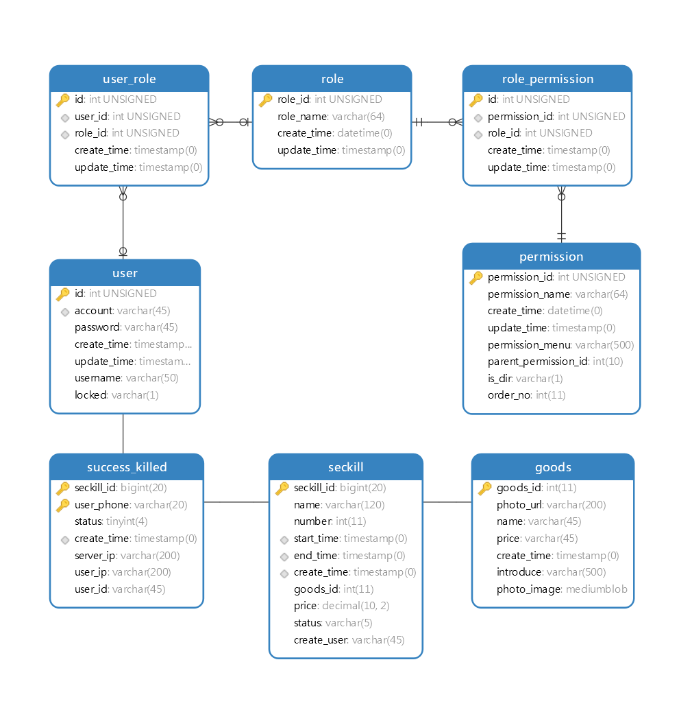

# 前言
项目命名为 **goodsKill**
一方面有商品秒杀的意思(好像有点chinglish的味道)，另外也可理解为 **good
skill**，本项目就是希望搭建一套完整的项目框架，把一些好的技术和开发技巧整合进来（偏向于后端技术），方便学习和查阅。

本项目为模拟秒杀项目，提供统一秒杀模拟请求接口，技术上整体采用SpringMVC +
Mybatis持久层框架，采用Dubbo3.x[1]，服务注册发现以及配置中心使用Nacos，支持数据库分库分表、分布式事务，使用状态机完成数据状态间的转换（基于Spring
Statemachine实现）。

## 💎 分支介绍

`master`分支基于最新Spring Cloud 2023.x + Spring Boot 3.x +
JDK21体系构建，目前仅保留核心的模拟秒杀API接口，如需使用Spring Boot
2.7.x + JDK11版本可以切换到tag
[v2.7.4](https://github.com/techa03/goodsKill/tree/v2.7.4)（支持登录注册以及简单的后台管理功能）。master分支目前升级改造中，功能不够稳定，如遇代码报错建议使用老版本。

本项目功能目前比较简陋且有很多不完善的地方，真实的秒杀场景远比本项目中的实现方式复杂，本项目省略了真实场景中的部分技术实现细节，目前仅作学习参考之用，如果觉得本项目对你有帮助的请多多star支持一下👍~~。

> 附：码云项目链接
> `https://gitee.com/techa/goodsKill`,clone速度慢的用码云仓库拉吧，不定期同步到码云~

## ✨ 技术选型

<table>
<colgroup>
<col style="width: 33%" />
<col style="width: 33%" />
<col style="width: 33%" />
</colgroup>
<thead>
<tr class="header">
<th style="text-align: left;">使用的工具或框架</th>
<th style="text-align: left;">名称</th>
<th style="text-align: left;">官网</th>
</tr>
</thead>
<tbody>
<tr class="odd">
<td style="text-align: left;">
Spring Boot
</td>
<td style="text-align: left;">
Spring Boot框架
</td>
<td style="text-align: left;">
<a
href="https://spring.io/projects/spring-boot">https://spring.io/projects/spring-boot</a>
</td>
</tr>
<tr class="even">
<td style="text-align: left;">
MyBatis-Plus
</td>
<td style="text-align: left;">
MyBatis增强工具
</td>
<td style="text-align: left;">
<a
href="https://mp.baomidou.com/">https://mp.baomidou.com/</a>
</td>
</tr>
<tr class="odd">
<td style="text-align: left;">
ZooKeeper
</td>
<td style="text-align: left;">
分布式协调服务
</td>
<td style="text-align: left;">
<a
href="http://zookeeper.apache.org/">http://zookeeper.apache.org/</a>
</td>
</tr>
<tr class="even">
<td style="text-align: left;">
Redis
</td>
<td style="text-align: left;">
分布式缓存数据库
</td>
<td style="text-align: left;">
<a
href="https://redis.io/">https://redis.io/</a>
</td>
</tr>
<tr class="odd">
<td style="text-align: left;">
Kafka
</td>
<td style="text-align: left;">
消息队列
</td>
<td style="text-align: left;">
<a
href="http://kafka.apache.org/">http://kafka.apache.org/</a>
</td>
</tr>
<tr class="even">
<td style="text-align: left;">
RabbitMQ
</td>
<td style="text-align: left;">
消息队列
</td>
<td style="text-align: left;">
<a
href="https://www.rabbitmq.com/">https://www.rabbitmq.com/</a>
</td>
</tr>
<tr class="odd">
<td style="text-align: left;">
MongoDB
</td>
<td style="text-align: left;">
Mongo数据库
</td>
<td style="text-align: left;">
<a
href="https://www.mongodb.com/">https://www.mongodb.com/</a>
</td>
</tr>
<tr class="even">
<td style="text-align: left;">
MySQL
</td>
<td style="text-align: left;">
MySQL数据库
</td>
<td style="text-align: left;">
<a
href="https://www.mysql.com/">https://www.mysql.com/</a>
</td>
</tr>
<tr class="odd">
<td style="text-align: left;">
Elasticsearch
</td>
<td style="text-align: left;">
全文搜索引擎
</td>
<td style="text-align: left;">
<a
href="https://www.elastic.co">https://www.elastic.co</a>
</td>
</tr>
<tr class="even">
<td style="text-align: left;">
Sharding-JDBC
</td>
<td style="text-align: left;">
分库分表组件
</td>
<td style="text-align: left;">
<a
href="https://shardingsphere.apache.org">https://shardingsphere.apache.org</a>
</td>
</tr>
<tr class="odd">
<td style="text-align: left;">
Spring Cloud Alibaba
</td>
<td style="text-align: left;">
Cloud Alibaba组件
</td>
<td style="text-align: left;">
<a
href="https://github.com/alibaba/spring-cloud-alibaba">https://github.com/alibaba/spring-cloud-alibaba</a>
</td>
</tr>
<tr class="even">
<td style="text-align: left;">
Apache Dubbo
</td>
<td style="text-align: left;">
RPC服务远程调用框架
</td>
<td style="text-align: left;">
<a
href="https://github.com/apache/dubbo">https://github.com/apache/dubbo</a>
</td>
</tr>
<tr class="odd">
<td style="text-align: left;">
Spring Cloud Gateway
</td>
<td style="text-align: left;">
网关组件
</td>
<td style="text-align: left;">
<a
href="https://spring.io/projects/spring-cloud-gateway">https://spring.io/projects/spring-cloud-gateway</a>
</td>
</tr>
<tr class="even">
<td style="text-align: left;">
Seata
</td>
<td style="text-align: left;">
分布式事务解决方案
</td>
<td style="text-align: left;">
<a
href="http://seata.io/zh-cn/index.html">http://seata.io/zh-cn/index.html</a>
</td>
</tr>
<tr class="odd">
<td style="text-align: left;">
Spring Security OAuth2.0
</td>
<td style="text-align: left;">
OAuth2.0授权组件
</td>
<td style="text-align: left;">
<a
href="https://spring.io/projects/spring-security-oauth">https://spring.io/projects/spring-security-oauth</a>
</td>
</tr>
<tr class="even">
<td style="text-align: left;">
GraphQL
</td>
<td style="text-align: left;">
一种用于 API 的查询语言
</td>
<td style="text-align: left;">
<a
href="https://docs.spring.io/spring-graphql/docs/current/reference/html">https://docs.spring.io/spring-graphql/docs/current/reference/html</a>
</td>
</tr>
<tr class="odd">
<td style="text-align: left;">
Spring Statemachine
</td>
<td style="text-align: left;">
Spring 状态机
</td>
<td style="text-align: left;">
<a
href="https://spring.io/projects/spring-statemachine">https://spring.io/projects/spring-statemachine</a>
</td>
</tr>
<tr class="even">
<td style="text-align: left;">
Sa-Token
</td>
<td style="text-align: left;">
轻量级权限认证框架
</td>
<td style="text-align: left;">
<a
href="https://sa-token.cc/">https://sa-token.cc/</a>
</td>
</tr>
<tr class="odd">
<td style="text-align: left;">
Flyway
</td>
<td style="text-align: left;">
数据库版本控制工具
</td>
<td style="text-align: left;">
<a
href="https://flywaydb.org/">https://flywaydb.org/</a>
</td>
</tr>
</tbody>
</table>

## 📝 项目模块介绍

    goodsKill
    |--goodskill-admin                          ||SpringBoot Admin监控服务端，支持Spring Cloud微服务发现
    |--goodskill-gateway                        ||微服务API网关，统一服务鉴权，支持动态路由加载
    |--goodskill-order-provider                 ||订单服务提供者
    |   |--goodskill-order-service
    |--goodskill-seckill-provider               ||秒杀服务提供者
    |   |--goodskill-api                        ||提供服务API接口
    |   |--goodskill-service                    ||服务API接口实现
    |--goodskill-spring-boot-starter            ||项目配置自动装配
    |--goodskill-web                            ||提供秒杀模拟接口访问
    |--goodskill-job                            ||elastic-job定时任务
    |--goodskill-seata                          ||集成nacos+dubbo+shardingjdbc+seata的分布式事务解决方案示例
    |--goodskill-auth                           ||auth登录以及授权模块
    |   |--auth-service                         ||基于Sa-Token框架的用户登录授权服务
        |--oauth2-auth-server                   ||oauth2.0登录授权服务端，自定义的登录授权服务
        |--oauth2-resource-server               ||oauth2.0资源服务端，自定义的登录授权服务

## 🔥🔥 秒杀方案

目前实现了几种秒杀方案，通过`SeckillMockController`提供测试接口

聚合网关Openapi文档地址:
`http://localhost/doc.html#/home`（需要开启网关服务）

Spring Boot Admin应用监控地址: `http://www.goodskill.com:19031`,
登录用户名密码：user/123456

-   场景一：Sychronized同步锁实现

-   场景二：Redisson分布式锁实现

-   场景三：ActiveMQ实现(已废弃)

-   场景四：Kafka消息队列实现

-   场景五：数据库原子性更新

-   场景六：实时等待秒杀处理结果(已废弃)

-   场景七：ZooKeeper分布式锁

-   场景八：使用Redis进行秒杀商品减库存操作，秒杀结束后异步发送MQ，使用MongoDB完成数据落地

-   场景九：Spring Cloud Stream实现

-   场景十：Sentinel限流+数据库原子性更新（需搭配sentinel控制台配置资源名`limit`的流控规则）

<!-- -->

    2021-04-14 21:58:59.857  INFO [goodskill-web,df43cc8f59291c48,df43cc8f59291c48] 15808 --- [           main] o.s.w.controller.SeckillMockController   : 秒杀场景二(redis分布式锁实现)开始时间：Wed Apr 14 21:58:59 CST 2021,秒杀id：1000
    2021-04-14 21:59:00.094  INFO [goodskill-web,144aa7910cca9520,2821cb8d62c5a908] 15808 --- [AClOSzbugzYng-1] o.s.w.s.c.SeckillMockResponseListener    : 秒杀活动结束，秒杀场景二(redis分布式锁实现)时间：Wed Apr 14 21:59:00 CST 2021,秒杀id：1000
    2021-04-14 21:59:00.101  INFO [goodskill-web,144aa7910cca9520,2821cb8d62c5a908] 15808 --- [AClOSzbugzYng-1] o.s.w.s.c.SeckillMockResponseListener    : 最终成功交易笔数统计中。。。
    2021-04-14 21:59:01.616  INFO [goodskill-web,144aa7910cca9520,2821cb8d62c5a908] 15808 --- [AClOSzbugzYng-1] o.s.w.s.c.SeckillMockResponseListener    : 最终成功交易笔数统计中。。。
    2021-04-14 21:59:03.129  INFO [goodskill-web,144aa7910cca9520,2821cb8d62c5a908] 15808 --- [AClOSzbugzYng-1] o.s.w.s.c.SeckillMockResponseListener    : 最终成功交易笔数：10
    2021-04-14 21:59:03.130  INFO [goodskill-web,144aa7910cca9520,2821cb8d62c5a908] 15808 --- [AClOSzbugzYng-1] o.s.w.s.c.SeckillMockResponseListener    : 历史任务耗时统计：StopWatch '': running time = 36159894800 ns
    ---------------------------------------------
    ns         %     Task name
    ---------------------------------------------
    4492195700  012%  秒杀场景四(kafka消息队列实现)
    3164155900  009%  秒杀场景八(秒杀商品存放redis减库存，异步发送秒杀成功MQ，mongoDb数据落地)
    6219218300  017%  秒杀场景十(Sentinel限流+数据库原子性更新)
    9189080600  025%  秒杀场景七(zookeeper分布式锁)
    3135926500  009%  秒杀场景五(数据库原子性更新update set num = num -1)
    3342791800  009%  秒杀场景九(基于springcloud stream rabbitmq)
    3343433700  009%  秒杀场景一(sychronized同步锁实现)
    3273092300  009%  秒杀场景二(redis分布式锁实现)

## 🧰 开发环境版本说明

-   JDK: OpenJDK21

-   Sharding-JDBC: 5.5.0

-   SpringCloud: 2023.x.x

-   SpringBoot: 3.2.x

-   SpringCloudAlibaba: 2023.x.x

-   Apache Dubbo: 3.x

-   使用的Docker镜像

    <table>
    <colgroup>
    <col style="width: 25%" />
    <col style="width: 25%" />
    <col style="width: 25%" />
    <col style="width: 25%" />
    </colgroup>
    <thead>
    <tr class="header">
    <th style="text-align: left;">镜像</th>
    <th style="text-align: left;">版本</th>
    <th style="text-align: left;">端口</th>
    <th style="text-align: left;">用户名密码</th>
    </tr>
    </thead>
    <tbody>
    <tr class="odd">
    <td style="text-align: left;">
Nacos
</td>
    <td style="text-align: left;">
2.3.2-slim
</td>
    <td style="text-align: left;">
8848
</td>
    <td style="text-align: left;">
nacos:nacos
</td>
    </tr>
    <tr class="even">
    <td style="text-align: left;">
Redis
</td>
    <td style="text-align: left;">
latest
</td>
    <td style="text-align: left;">
6379
</td>
    <td style="text-align: left;">
密码:123456
</td>
    </tr>
    <tr class="odd">
    <td style="text-align: left;">
Kafka
</td>
    <td style="text-align: left;">
3.1.1
</td>
    <td style="text-align: left;">
9092
</td>
    <td style="text-align: left;">
无
</td>
    </tr>
    <tr class="even">
    <td style="text-align: left;">
KafkaManager
</td>
    <td style="text-align: left;">
latest
</td>
    <td style="text-align: left;">
9001:9000
</td>
    <td style="text-align: left;">
无
</td>
    </tr>
    <tr class="odd">
    <td style="text-align: left;">
Mongo
</td>
    <td style="text-align: left;">
6.0.7
</td>
    <td style="text-align: left;">
27017
</td>
    <td style="text-align: left;">
无
</td>
    </tr>
    <tr class="even">
    <td style="text-align: left;">
MySQL
</td>
    <td style="text-align: left;">
8.0.29
</td>
    <td style="text-align: left;">
3306
</td>
    <td style="text-align: left;">
root:Password123
</td>
    </tr>
    <tr class="odd">
    <td style="text-align: left;">
Zookeeper
</td>
    <td style="text-align: left;">
3.6.2
</td>
    <td style="text-align: left;">
2181
</td>
    <td style="text-align: left;">
无
</td>
    </tr>
    <tr class="even">
    <td style="text-align: left;">
Elasticsearch
</td>
    <td style="text-align: left;">
7.17.3
</td>
    <td style="text-align: left;">
9200 9300
</td>
    <td style="text-align: left;">
无
</td>
    </tr>
    <tr class="odd">
    <td style="text-align: left;">
Kibana
</td>
    <td style="text-align: left;">
7.17.3
</td>
    <td style="text-align: left;">
5601
</td>
    <td style="text-align: left;">
无
</td>
    </tr>
    <tr class="even">
    <td style="text-align: left;">
RabbitMQ
</td>
    <td style="text-align: left;">
latest
</td>
    <td style="text-align: left;">
5672 15672
</td>
    <td style="text-align: left;">
无
</td>
    </tr>
    </tbody>
    </table>

## 📚分库分表情况说明

<table style="width:100%;">
<colgroup>
<col style="width: 16%" />
<col style="width: 16%" />
<col style="width: 16%" />
<col style="width: 16%" />
<col style="width: 16%" />
<col style="width: 16%" />
</colgroup>
<thead>
<tr class="header">
<th style="text-align: left;">表</th>
<th style="text-align: left;">数据库</th>
<th style="text-align: left;">是否分库</th>
<th style="text-align: left;">分库字段</th>
<th style="text-align: left;">是否分表</th>
<th style="text-align: left;">分表字段</th>
</tr>
</thead>
<tbody>
<tr class="odd">
<td style="text-align: left;">
success_killed
</td>
<td style="text-align: left;">
MySQL
</td>
<td
style="text-align: left;">
是（同一服务器中，分为seckill和seckill_01两个库）
</td>
<td style="text-align: left;">
seckill_id
</td>
<td
style="text-align: left;">
是（分为success_killed_0,success_kill_1两张表）
</td>
<td style="text-align: left;">
user_phone
</td>
</tr>
</tbody>
</table>

其他表均未分库分表，默认使用seckill作为主库

### API接口说明

## 💻相关页面展示

### 模拟秒杀接口测试

## 📑数据库表结构

## 📖参考文档

-   解决Docker容器连接 Kafka
    连接失败问题：`https://www.cnblogs.com/hellxz/p/why_cnnect_to_kafka_always_failure.html`

[1] 由于SpringCloudAlibaba官方暂未支持Dubbo
3.x，本项目采用dubbo-spring-boot-starter集成

[2] 需要安装docker-desktop
<https://www.docker.com/products/docker-desktop/>

[3] 附
[SpringCloudAlibaba](https://start.aliyun.com/bootstrap.html)兼容版本说明
